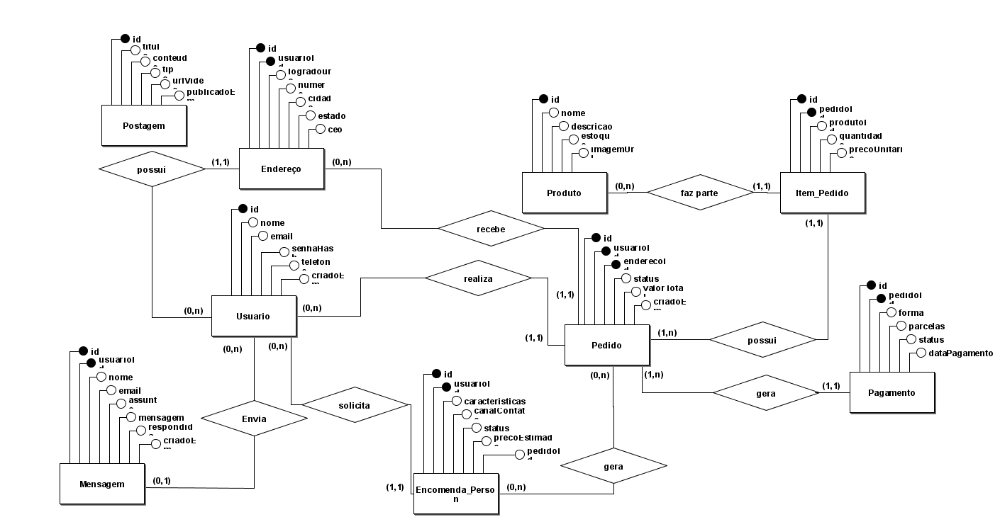
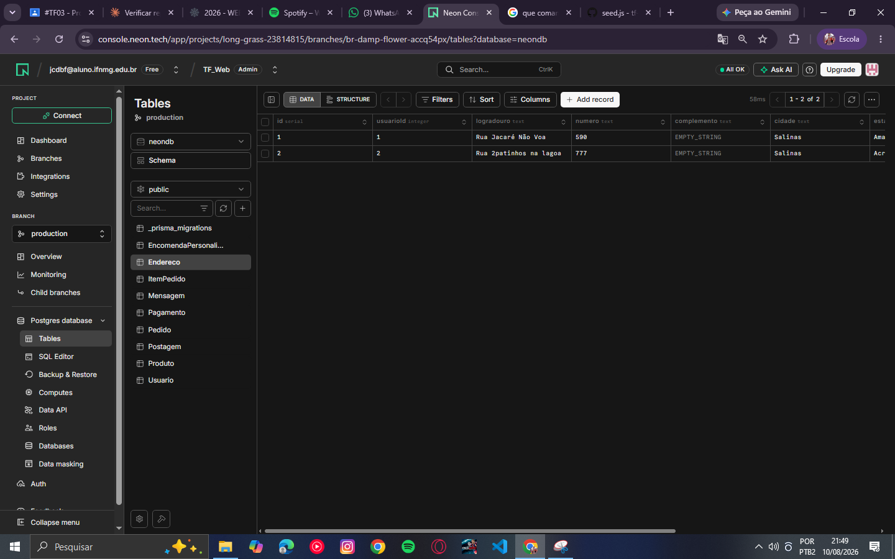
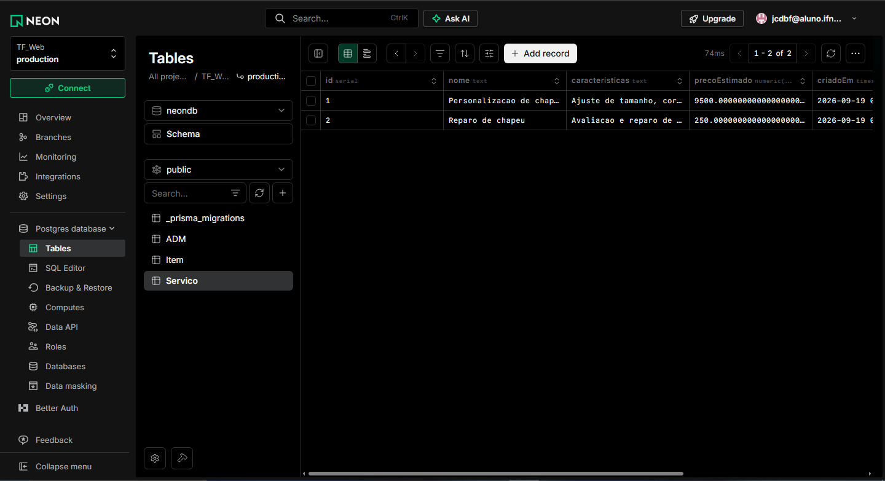
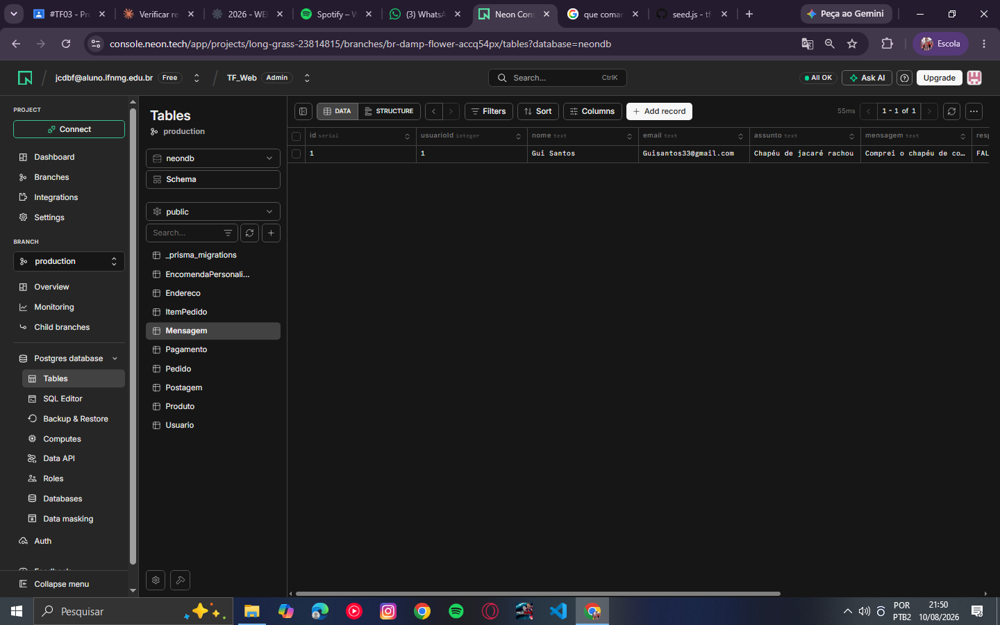

# Os Trapalhões

## Integrantes
[comment] <> (

    Breno Henrique Rodrigues Rocha
    https://github.com/bhrr-alt
    
    Enzo Noah 
    https://github.com/QualquerNome139
    
    Gustavo Santos
    https://github.com/Didi-show
    
    Júlio César Dias Barbosa Filho
    https://github.com/jcdbf-a11y
    
    Matheus Henrique
    https://github.com/matheus44244
)
## Sobre o projeto

**Tema:** Um site que de venda e constomização de chapeus além de conselhos para melhor
qualidade e tempo util do seu chapeu.
**Usuários do sistema:** clientes que desejam comprar chapéus prontos, encomendar peças
personalizadas, tirar dúvidas com a equipe de suporte e consumir conteúdo educativo
sobre cuidados com o produto.

**Problema que resolve:** hoje o maior problema é para fazer as diversas vendas e 
customização de varias pessoas, isso costumam estar espalhados em canais diferentes como
(WhatsApp, Instagram). O sistema centraliza tudo em um único lugar.

## Modelo Conceitual

[Modelo Logico](prisma/schema.prisma)
[Modelo Físico](prisma/seed.js)

### Entidades

**Usuario** — representa o cliente cadastrado na plataforma. Possui `id` (identificador
único), `nome` e `email` (para identificação e login), `senhaHash` (senha armazenada de
forma segura, nunca em texto puro), `telefone` (opcional, pois nem todo cliente informa
esse dado no cadastro) e `criadoEm` (data de criação, útil para métricas e suporte). É o
centro do domínio: origina endereços, pedidos, encomendas e mensagens de contato.

**Endereço** — representa um endereço de entrega cadastrado por um usuário. Possui `id`,
`usuarioId` (chave estrangeira obrigatória, já que todo endereço pertence a um cliente),
`logradouro`, `numero` (opcional, pois nem todo endereço tem apartamento
ou bloco), além de `cidade`, `estado` e `cep`, necessários para calcular frete e entrega.
Um cliente pode ter mais de um endereço (ex: casa e trabalho), por isso a relação é de
um-para-muitos.

**Produto** — representa os chapéus disponíveis para compra direta na loja. Possui `id`,
`nome` e `descricao` (para exibição no catálogo), `estoque` (para controle de
venda e disponibilidade) e `imagemUrl` (para exibição visual do produto na loja online).

**Pedido** — representa uma compra feita por um usuário. Possui `id`, `usuarioId` e
`enderecoId` (chaves estrangeiras obrigatórias — todo pedido pertence a um cliente e é
entregue em um endereço específico), `status` (para acompanhar o ciclo da compra:
pendente, pago, enviado, entregue ou cancelado), `valorTotal` (soma dos itens) e
`criadoEm` (para rastrear quando o pedido foi feito e a última mudança de
status).

**Item_Pedido** — entidade associativa entre Pedido e Produto, criada para resolver o
relacionamento N:N entre os dois (um pedido tem vários produtos, e um produto pode estar
em vários pedidos). Possui `id`, `pedidoId` e `produtoId` (chaves estrangeiras
obrigatórias), `quantidade` (quantos itens desse produto foram comprados) e
`precoUnitario` (o preço travado no momento da compra, para que uma mudança futura no
preço do produto não altere pedidos já feitos).

**Pagamento** — representa os dados de pagamento de um pedido. Possui `id`, `pedidoId`
(chave estrangeira única, já que cada pedido tem no máximo um pagamento), `forma` (pix,
cartão ou boleto), `parcelas` (número de parcelas escolhido), `status` (pendente,
aprovado ou recusado) e `dataPagamento` (opcional, pois só é preenchida quando o
pagamento é de fato efetivado, e não no momento em que o registro é criado).

**Encomenda_Personalizada** — representa uma solicitação de chapéu sob medida. Possui
`id`, `usuarioId` (chave estrangeira obrigatória), `caracteristicas` (texto livre com
cor, tamanho, aba e material desejados), `canalContato` (opcional, pois nem toda
encomenda registra por qual canal — WhatsApp, Instagram, e-mail — o cliente entrou em
contato), `status` (solicitado, orçado, aprovado, em produção ou concluído),
`precoEstimado` (opcional, pois só existe depois que a equipe faz o orçamento) e
`pedidoId` (opcional, pois só é preenchido se a encomenda for aprovada e virar um
pedido de fato).

**Postagem** — representa o conteúdo do blog institucional, com dicas e cuidados sobre
o produto. Possui `id`, `titulo` e `conteudo` (o texto da publicação), `tipo` (indica se
é um post de texto ou um vídeo), `urlVideo` (opcional, pois só é preenchido quando
`tipo` é vídeo) e `publicadoEm` (data de publicação, usada para ordenar o blog). Não
depende de nenhuma outra entidade, pois é conteúdo institucional fixo.

**Mensagem** — representa uma mensagem de contato/suporte enviada à equipe. Possui `id`,
`usuarioId` (opcional, para permitir que visitantes não cadastrados também enviem
mensagem), `nome` (opcional, só necessário quando não há usuário logado para identificar
quem enviou), `email` e `assunto`/`mensagem` (conteúdo do contato) e `respondida`
(booleano que indica se a equipe já deu retorno).

### Relacionamentos

- Um **Usuario** pode ter vários **Endereços**, mas cada Endereço pertence a um único Usuario.
- Um **Endereço** pode receber vários **Pedidos**, mas cada Pedido é entregue em um único Endereço.
- Um **Usuario** pode realizar vários **Pedidos**, mas cada Pedido pertence a um único Usuario.
- Um **Produto** pode fazer parte de vários **Item_Pedido**, mas cada Item_Pedido referencia um único Produto.
- Uma **Encomenda_Personalizada** pode gerar varias **Pedido**, e um **Pedido** pode ter varias Encomenda_Personalizada de origem.
- Um **Pedido** possui um ou mais **Item_Pedido** (nunca um pedido vazio), e cada Item_Pedido pertence a um único Pedido.
- Um **Pedido** gera no máximo um **Pagamento**, e cada Pagamento pertence a exatamente um Pedido.
- Um **Usuario** pode solicitar várias **Encomenda_Personalizada**, mas cada Encomenda pertence a um único Usuario.
- Um **Usuario** pode enviar várias **Mensagens**, mas cada Mensagem pertence a no máximo um Usuario (visitantes também podem enviar).

